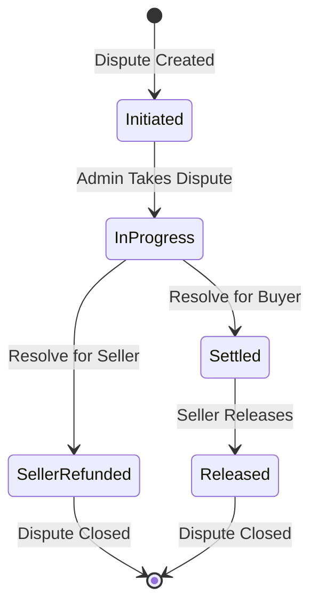
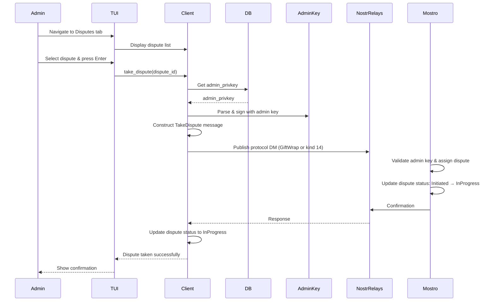
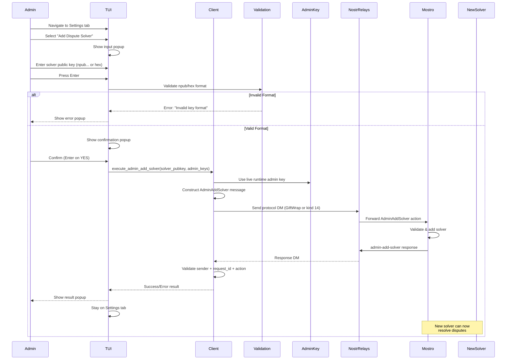
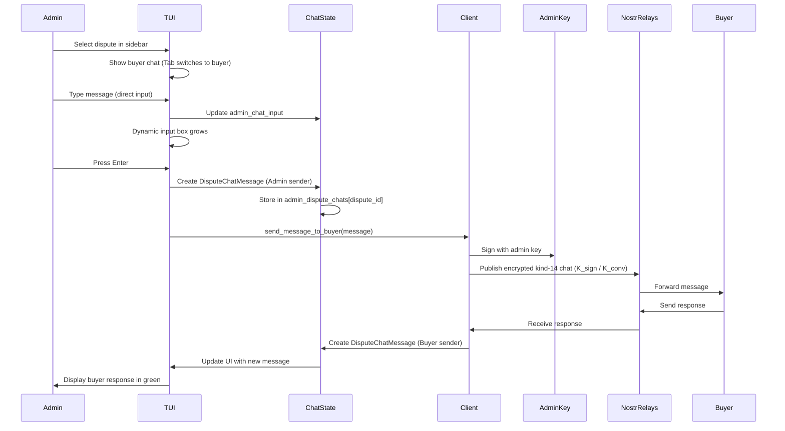
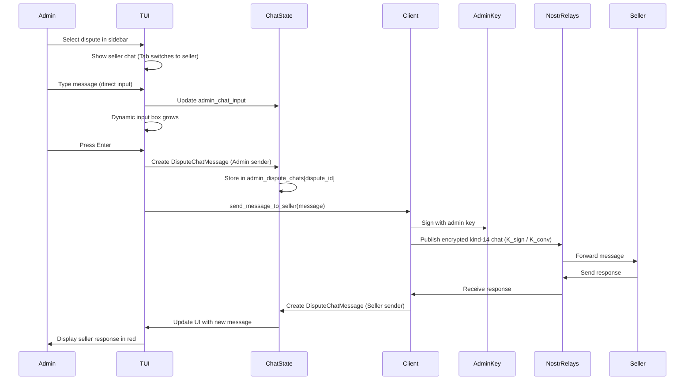

# Admin Dispute Resolution

This guide explains the admin mode functionality for dispute resolution in Mostrix. Admin mode allows authorized users to resolve disputes between buyers and sellers on the Mostro network.

## Admin Mode Overview

Admin mode can be activated in two ways:

- **On startup (default mode)**: set `user_mode = "admin"` and configure a valid `admin_privkey` in `settings.toml`.
- **At runtime (TUI switch)**: start in user mode and press **`M`** in the **Settings** tab to toggle between User and Admin modes. The selected mode is persisted back to `settings.toml` (`user_mode` field).

Only the admin private key can be used to sign dispute resolution actions.

**Source**: `src/settings.rs:12`

```12:12:src/settings.rs
    pub admin_privkey: String,
```

## Admin Tabs

The admin interface provides dedicated tabs for dispute management:

### 1. Disputes Pending Tab

Lists pending disputes on the Mostro network (state: `Initiated`, filtered via `get_initiated_disputes`). Admins can:

- **View dispute details**: Dispute ID, status, and **Created** time — the kind-38386 `created_at` **tag** (SQLite dispute open time from Mostro; see [mostro#878](https://github.com/MostroP2P/mostro/pull/878)). Falls back to Nostr `event.created_at` (last publish) only for older events without the tag. The Created column drops on narrow terminals.
- **Take a dispute**: Select a dispute and press Enter to take ownership
- **Navigate**: ↑↓ browse the list; selection is by dispute UUID (`selected_pending_dispute_id`), resolved through `selected_pending_dispute` / `move_pending_dispute_selection` in `src/ui/helpers/dispute_selection.rs`
- **Scrolling**: persistent `disputes_table_state` + `render_table_list_scrollbar` (same offset/track pattern as the Orders tab)

### 2. Disputes in Progress Tab

**Status**: ✅ **Fully Implemented with Complete Chat System**

Shows disputes that have been taken by this admin (state: `InProgress`). This is the primary workspace for resolving disputes.

#### Layout

The interface is divided into three main sections:

1. **Left Sidebar (20%)**: List of disputes in progress (or finalized when Shift+C filter is active)
   - Shows truncated dispute IDs (safely handles short IDs without panicking)
   - **Selection by dispute id** (`AppState.selected_dispute_id`), resolved through `get_filtered_disputes` / `selected_filtered_dispute` / `move_dispute_selection` in `src/ui/helpers/dispute_selection.rs` — Up/Down and all chat/finalize/attachment actions use the **visible** filtered list, never a raw index into mixed open+closed rows
   - **Scrollable list**: stateful `List` + `ListState` keeps the highlighted row in view when disputes overflow the sidebar; vertical scrollbar via shared `render_table_list_scrollbar` (viewport offset, data-row track)
   - Highlighted selection with Up/Down arrow keys (skips disputes hidden by the current filter)
   - Updates main area when selection changes
   - Shows "No disputes in progress" / "No finalized disputes" when empty

2. **Main Area (80%)**:
   - **Empty State**: When no disputes are available, displays "Select a dispute from the sidebar" with a footer showing key hints (filter + `↑↓: Select Dispute | Ctrl+H: Help`). The footer is width-aware and always includes Ctrl+H for the help popup.
   - **Header (7 lines)**: Comprehensive dispute information
     - Dispute ID, Type, Status
     - Creation date and timestamps
     - Initiator role (Buyer or Seller with pubkey)
     - Privacy indicators (🟢 info available / 🔴 private)
     - Amount in sats and fiat
     - User ratings with operating days
   - **Party Tabs (3 lines)**: Buyer/Seller chat selection buttons
     - Green "BUYER" button with truncated pubkey
     - Red "SELLER" button with truncated pubkey
     - Tab key switches between parties
   - **Chat Area (flexible)**: Scrollable message history
     - Color-coded messages (Cyan=Admin, Green=Buyer, Magenta=Seller)
     - PageUp/PageDown scrolling
     - Shows "No messages yet" when empty
   - **Input Box (dynamic 1-10 lines)**: Message composition
     - Grows automatically based on content
     - Yellow bold border when focused
     - Text wrapping with word boundaries
   - **Footer (1–2 lines)**: Context-sensitive keyboard shortcuts. The footer is **width-aware**: on very narrow terminals it shows only **Ctrl+H: Help**; on medium width it shows essential keys plus Ctrl+H; on wide terminals it can render on two lines with the full list. All variants include **Ctrl+H: Help** to open the context-aware shortcuts popup.

#### Dispute Management Features

- **Real-time chat**: Direct typing with instant visual feedback
- **Party switching**: Tab key toggles between buyer and seller
- **Message history**: Per-dispute chat storage with scrolling
- **Dynamic input**: Input box grows from 1 to 10 lines
- **Selection safety**: chat send, Shift+F finalize, Ctrl+S save-attachment, and chat scroll all call `selected_filtered_dispute` so messages are encrypted to the shared key of the dispute the sidebar highlights (avoids silently targeting a closed dispute sorted above an open one by `taken_at DESC`)
   - **Finalization**: Press **Shift+F** for the finalize popup (💰 pay buyer / ↩️ refund seller bodies show **Admin settle** / **Admin cancel**; optional bond slash when instance `bond_enabled` is true on kind 38385; **Esc** to close). Confirm shows bond recap when bonds are enabled. Execute: `execute_finalize_dispute` → `execute_admin_settle` / `execute_admin_cancel` (`request_id`, `wait_for_dm`, `handle_mostro_response` for `CantDo`); success toast via `BondSlashChoice::finalize_success_message`. See [FINALIZE_DISPUTES.md](FINALIZE_DISPUTES.md).
- **Visual indicators**: Focus states, colors, and icons for clarity

#### Keyboard Navigation

- **Up/Down**: Select dispute in sidebar (moves within the filtered list; viewport scrolls to keep selection visible)
- **Tab**: Switch between buyer and seller chat
- **Type**: Start composing message (when input enabled)
- **Enter**: Send message (when input has text)
- **Shift+F**: Open finalization popup for the selected dispute
- **PageUp/PageDown**: Scroll chat history
- **End**: Jump to bottom of chat (latest messages)
- **Shift+I**: Toggle chat input enabled/disabled
- **Backspace**: Delete characters (when input enabled)
- **Ctrl+H**: Open help popup with all shortcuts for this tab (Esc/Enter/Ctrl+H to close)

See [FINALIZE_DISPUTES.md](FINALIZE_DISPUTES.md) for detailed finalization workflow.

### 3. Observer Tab

**Status**: ✅ **Implemented – Relay-based chat inspection**

The Observer tab is a read-only tool that lets admins inspect encrypted user-to-user chats by fetching kind-14 events from Nostr relays. A party involved in a dispute discloses **`K_conv` only** (My Trades **Shift+K**) — never `K_sign`. `K_conv` decrypts the conversation but cannot author a valid kind-14 envelope as `pub(K_sign)`, so Observer access is read-only by construction.

#### Observer Workflow

1. **Acquire `K_conv`**:
   - During a dispute, one of the parties discloses **`K_conv`** (64-character hex). In Mostrix this is **Shift+K** on My Trades. They may also share **`pub(K_sign)`** as an optional locator for an `authors` filter. Never accept or ask for the `K_sign` secret.
2. **Open Observer tab**:
   - Switch to Admin mode and navigate to the **Observer** tab.
3. **Paste keys**:
   - In the **K_conv** field, paste the 64-char hex grant. Optionally paste **`pub(K_sign)`** (hex or npub) in the second field. **Tab** switches focus. Paste supports bracketed paste into the focused field.
4. **Fetch and view chat**:
   - Press **Enter** to:
     - Validate `K_conv` (non-empty, valid hex secret).
     - Parse optional `pub(K_sign)`; invalid locators fail closed.
     - Fetch kind-14 events for the last 7 days: `authors = [pub(K_sign)]` when the locator is present, otherwise `#p = pub(K_conv)` (junk may arrive; decrypt fails).
     - Unwrap with `K_conv` against the known-role map (admin key plus buyer/seller trade pubkeys from taken disputes). Unknown inner signers are dropped.
     - Fetch fails if the known-role map is empty (no admin keys and no taken-dispute party pubkeys).
     - Parse attachments (Mostro Mobile Encrypted File Messaging format: `image_encrypted` / `file_encrypted`).
   - The chat is displayed using the same rich formatting as the dispute chat: color-coded sender labels (Cyan=Admin, Green=Buyer, Magenta=Seller), timestamps, and attachment indicators.
5. **Save attachments**:
   - Press **Ctrl+S** to open a save-attachment popup listing all file/image attachments found in the observer chat. Select with **Up/Down**, save with **Enter**, cancel with **Esc**. Files are saved to `~/.mostrix/downloads/observer_<key_prefix>_<filename>`.

#### Observer Keyboard Shortcuts

- **Enter**: Fetch chat from relays using `K_conv` (and optional `pub(K_sign)`).
- **Tab / Shift+Tab**: Switch focus between `K_conv` and `pub(K_sign)`.
- **Ctrl+C**: Clear inputs, messages, error state, and loading indicator. Sensitive data is securely cleared with `zeroize`.
- **Ctrl+S**: Open save-attachment popup (when attachments are present in the fetched chat).
- **Ctrl+H**: Open help popup with Observer shortcuts (Esc/Enter/Ctrl+H to close).

When validation or fetching fails (empty key, invalid hex, no messages found, decryption error), Observer sets an inline error message in the header **and** raises a shared `OperationResult` popup showing the failure reason. Closing this popup with **Esc** or **Enter** keeps the admin on the **Observer** tab so they can immediately fix the input and retry.

#### Observer State (AppState)

- `observer_shared_key_input: String` -- disclosed `K_conv` hex.
- `observer_sign_pubkey_input: String` -- optional `pub(K_sign)` locator.
- `observer_input_focus` -- which field receives typing/paste.
- `observer_messages: Vec<DisputeChatMessage>` -- fetched and decrypted chat messages.
- `observer_loading: bool` -- indicates an async fetch is in progress.
- `observer_error: Option<String>` -- inline error message.
- `UiMode::ObserverSaveAttachmentPopup(usize)` -- active when the save-attachment popup is open for observer messages.

The fetch is performed asynchronously via `tokio::spawn` calling `chat_utils::fetch_observer_chat`. Results are sent back to the main event loop through the `order_result_tx` channel using the `OperationResult::ObserverChatLoaded` and `OperationResult::ObserverChatError` variants.

When closing the **operation result** popup from the **Disputes in Progress** tab (e.g. after saving an attachment or after a finalization result), the app stays on Disputes in Progress and returns to **ManagingDispute** mode instead of switching to the first tab.

> **Note**: Observer fetches kind-14 messages using disclosed `K_conv` and authenticates inner signers against taken-dispute party pubkeys plus the admin key (`fetch_observer_chat` / `observer_known_signer_roles`). GiftWrap cannot be unwrapped from `K_conv` alone. Sensitive data is securely cleared from memory via `zeroize` when the admin clears the observer state with Ctrl+C.

**Source**: `src/ui/tabs/observer_tab.rs` (rendering), `src/ui/key_handler/enter_handlers.rs` (Enter handler), `src/util/chat_utils.rs` (`fetch_observer_chat`), `src/ui/key_handler/mod.rs` (Ctrl+S and observer save-attachment popup handling), `src/ui/save_attachment_popup.rs` (`render_observer_save_attachment_popup`)

### 4. Settings Tab

**Status**: ✅ **Fully Implemented and Working**

The Settings tab provides comprehensive configuration options for both User and Admin modes. The available options differ based on the current role.

#### User Mode Options

1. **Change Mostro Pubkey**: Update the Mostro instance pubkey used by the client (hex format, 64 characters).
2. **Add Nostr Relay**: Add a new Nostr relay to the relay list (must start with `wss://`). Relays are added to the running client immediately.
3. **Add Currency Filter**: Adds fiat currency codes (e.g., USD, EUR) to the `currencies_filter` array in `settings.toml`. The fetch scheduler in Mostrix reloads `currencies_filter` on each tick and uses it to filter which orders are visible: only orders whose fiat code is in this list are shown. The *list of available* fiat currencies is still defined by the Mostro instance via the `fiat_currencies_accepted` tag in its status event; the filter in `settings.toml` only narrows which of those are displayed. Same behaviour in Admin mode.
4. **Clear Currency Filters**: Clears the `currencies_filter` array in `settings.toml`. An empty list means no filter: all orders from the Mostro instance are shown again. The scheduler picks up the change on the next tick.

#### Admin Mode Options

1. **Change Mostro Pubkey**: Update the Mostro instance pubkey used by the client (hex format, 64 characters).
2. **Add Nostr Relay**: Add a new Nostr relay to the relay list (must start with `wss://`). Relays are added to the running client immediately.
3. **Add Currency Filter**: Same as in User mode: adds codes to `currencies_filter` in `settings.toml`; the scheduler uses this to filter visible orders. Mostro’s `fiat_currencies_accepted` defines which currencies the instance supports; Mostrix uses `currencies_filter` only to restrict which orders are shown.
4. **Clear Currency Filters**: Clears `currencies_filter` in `settings.toml`; the scheduler then shows all orders (no currency filter) on the next fetch.
5. **Add Dispute Solver**: Add a new dispute solver to the network (see [Adding a Solver](#adding-a-solver) section).
6. **Change Admin Key**: Update the admin private key used for signing dispute actions.

#### Settings Tab Features

- **Mode Display**: Shows current mode (User/Admin) at the top
- **Mode Switching**: Press `M` key to switch between User and Admin modes
- **Confirmation Popups**: All settings changes require confirmation before saving
- **Input Validation**: All inputs are validated before processing:
  - Mostro pubkey: Must be 64-character hex string
  - Relay URLs: Must start with `wss://`
  - Currency codes: Non-empty, max 10 characters
  - Solver public key: Accepts `npub1...` **or** 64-char hex public key
  - Admin private key: Accepts `nsec1...` **or** 64-char hex secret key
- **Keyboard Input**: All inputs support both paste and keyboard entry
- **Settings Persistence**: All changes are saved to `settings.toml` file
- **Error Handling**: Invalid inputs display error popups with clear messages
- **Dynamic Updates**:
  - Relays are added to the running Nostr client immediately
  - Currency filters are applied in real-time to order fetching
  - Status bar displays current settings (Mostro pubkey, relays, currencies)

**Source**: `src/ui/settings_tab.rs`, `src/ui/key_handler/settings.rs`, `src/ui/key_handler/validation.rs`

## Dispute States

Disputes progress through different states during their lifecycle. Understanding these states helps admins know what actions are available and what the current status of a dispute is.

The dispute `Status` enum defines the possible states:

```rust
pub enum Status {
    /// Dispute initiated and waiting to be taken by a solver
    #[default]
    Initiated,
    /// Taken by a solver
    InProgress,
    /// Canceled by admin/solver and refunded to seller
    SellerRefunded,
    /// Settled seller's invoice by admin/solver and started to pay sats to buyer
    Settled,
    /// Released by the seller
    Released,
}
```

### State Descriptions

#### 1. `Initiated` (Default)

- **Meaning**: The dispute has been created and is waiting for an admin/solver to take ownership.
- **Admin Actions Available**:
  - Take the dispute (moves to `InProgress`)
  - View dispute details
- **Next State**: `InProgress` (when taken by admin)

#### 2. `InProgress`

- **Meaning**: An admin/solver has taken ownership of the dispute and is actively working on resolution.
- **Admin Actions Available**:
  - Communicate with buyer and seller
  - Request additional information
  - Resolve in favor of buyer (moves to `Settled`)
  - Resolve in favor of seller (moves to `SellerRefunded`)
- **Next States**: `Settled`, `SellerRefunded`, or `Released`

#### 3. `SellerRefunded`

- **Meaning**: The dispute was resolved in favor of the seller. The seller has been refunded, and the buyer's payment was returned.
- **Admin Actions Available**:
  - View dispute history (dispute is closed)
- **Final State**: No further actions possible

#### 4. `Settled`

- **Meaning**: The admin/solver has settled the seller's invoice and started the process of paying sats to the buyer. This indicates resolution in favor of the buyer.
- **Admin Actions Available**:
  - Monitor payment completion
  - View dispute history
- **Next State**: `Released` (when seller releases)

#### 5. `Released`

- **Meaning**: The seller has released the funds, completing the dispute resolution process.
- **Admin Actions Available**:
  - View dispute history (dispute is closed)
- **Final State**: No further actions possible

### State Transition Flow



### State Color Coding

In the UI, dispute states are color-coded for quick visual identification:

- **Yellow**: `Initiated` (pending/waiting)
- **Green**: `InProgress`, `Settled`, `Released` (active/resolved)
- **Red**: `SellerRefunded` (refunded/canceled)

**Source**: `src/ui/mod.rs:482` (`apply_status_color`)

## Dispute Resolution Flow

### Taking a Dispute

When an admin takes a dispute from the disputes list:



**Key Points**:

- Only the `admin_privkey` can sign dispute resolution actions
- The dispute is assigned to the admin who takes it
- Other admins cannot take a dispute that's already been taken
- The admin becomes responsible for resolving the dispute
- Upon taking a dispute, the admin receives a `SolverDisputeInfo` struct with all dispute details

### Dispute Information Structure

When an admin takes a dispute, they receive a `SolverDisputeInfo` struct containing all relevant information about the dispute:

```rust
pub struct SolverDisputeInfo {
    pub id: Uuid,
    pub kind: String,
    pub status: String,
    pub hash: Option<String>,
    pub preimage: Option<String>,
    pub order_previous_status: String,
    pub initiator_pubkey: String,
    pub buyer_pubkey: Option<String>,
    pub seller_pubkey: Option<String>,
    pub initiator_full_privacy: bool,
    pub counterpart_full_privacy: bool,
    pub initiator_info: Option<UserInfo>,
    pub counterpart_info: Option<UserInfo>,
    pub premium: i64,
    pub payment_method: String,
    pub amount: i64,
    pub fiat_amount: i64,
    pub fee: i64,
    pub routing_fee: i64,
    pub buyer_invoice: Option<String>,
    pub invoice_held_at: i64,
    pub taken_at: i64,
    pub created_at: i64,
}
```

#### Field Descriptions

**Identity & Status**:

- **`id`**: Unique identifier (UUID) for the **order** associated with this dispute. Mostrix stores this as the primary key in the `admin_disputes` table and uses it as the ID sent to Mostro when performing admin finalization actions (`AdminSettle` / `AdminCancel`). Optional [`bond_resolution`](https://mostro.network/protocol/admin_settle_order.html) payload is sent via [`BondSlashChoice::to_optional_payload()`](../src/util/order_utils/bond_resolution.rs) from the admin’s choice on the finalize popup (default 🔓 no slash).
- **`kind`**: Order kind (e.g., "Buy" or "Sell")
- **`status`**: Current dispute status (see [Dispute States](#dispute-states) section)
- **`order_previous_status`**: The order's status before the dispute was initiated

**Lightning Network Details**:

- **`hash`**: Lightning invoice hash (if applicable)
- **`preimage`**: Lightning invoice preimage (if available)
- **`buyer_invoice`**: Lightning invoice provided by the buyer (if applicable)
- **`invoice_held_at`**: Timestamp when the invoice was held/created

**Parties Involved**:

- **`initiator_pubkey`**: Public key of the user who initiated the dispute
- **`buyer_pubkey`**: Public key of the buyer (if available)
- **`seller_pubkey`**: Public key of the seller (if available)
- **`initiator_full_privacy`**: Whether the dispute initiator has full privacy enabled
- **`counterpart_full_privacy`**: Whether the counterparty has full privacy enabled
- **`initiator_info`**: Optional user information for the dispute initiator (name, reputation, etc.)
- **`counterpart_info`**: Optional user information for the counterparty (name, reputation, etc.)

**Financial Details**:

- **`amount`**: Amount in satoshis
- **`fiat_amount`**: Amount in fiat currency
- **`premium`**: Premium amount (in satoshis)
- **`fee`**: Fee amount (in satoshis)
- **`routing_fee`**: Lightning routing fee (in satoshis)
- **`payment_method`**: Payment method used

**Timestamps**:

- **`created_at`**: Timestamp when the dispute was created
- **`taken_at`**: Timestamp when the admin took the dispute

#### Using Dispute Information

This comprehensive information allows admins to:

1. **Understand the context**: Review order details, parties involved, and dispute circumstances
2. **Assess privacy settings**: Know if parties have full privacy enabled (affects available information)
3. **Review financial details**: Understand amounts, fees, and payment methods
4. **Check Lightning status**: Verify invoice details and payment state
5. **Make informed decisions**: Use all available information to resolve the dispute fairly

**Privacy Considerations**:

- If `initiator_full_privacy` or `counterpart_full_privacy` is `true`, some user information may be limited
- `initiator_info` and `counterpart_info` may be `None` if privacy is enabled
- Admins should respect privacy settings while gathering necessary information for resolution

**Data Validation**:

- **Required Fields**: `buyer_pubkey` and `seller_pubkey` are validated when taking a dispute. If either field is missing, the dispute cannot be saved to the database and an error is displayed.
- **Data Integrity**: The finalization popup also validates these fields before displaying dispute details. If data is incomplete, a "Data Integrity Error" popup is shown instead of the finalization options.
- **Shared-key sanity**: When saving a dispute, the client checks that buyer and seller derived shared keys differ when the two pubkeys differ. If they are identical, an error is logged (see [KEY_MANAGEMENT.md](KEY_MANAGEMENT.md)).

**Post-Finalization Action Blocking**:

Once a dispute is finalized (status: `Settled`, `SellerRefunded`, or `Released`), the AdminSettle and AdminCancel actions are blocked at multiple levels:

- **Model Layer**: `AdminDispute::is_finalized()` returns `true` for finalized disputes. The helper methods `can_settle()` and `can_cancel()` return `false` when finalized.
- **UI Layer**: The finalization popup disables and grays out the pay/refund buttons (inner body `—`).
- **Handler Layer**: `execute_finalize_dispute()` checks the dispute state before executing any action. If the dispute is already finalized, it returns an error: "Cannot execute [action]: dispute is already finalized".
- **Key Handler Layer**: When pressing Enter on a disabled action button, an error message is displayed: "Cannot finalize: dispute is already finalized".

This multi-layered protection ensures that finalized disputes cannot be accidentally or maliciously modified.

**Source**: `src/models.rs` (AdminDispute::is_finalized, can_settle, can_cancel), `src/util/order_utils/execute_finalize_dispute.rs`

### Adding a Solver

**Status**: ✅ **Implemented and Working**

When an admin adds another dispute solver from the Settings tab:



**Implementation Notes**:

- `execute_admin_add_solver` now uses **live runtime admin keys** passed by the UI context, not startup `SETTINGS` snapshots, so admin key changes apply immediately without restart.
- The Add Solver flow now waits for Mostro response (`wait_for_dm` + `parse_dm_events`) and validates:
  - response sender is `mostro_pubkey`
  - request id (`handle_mostro_response`)
  - response action is `AdminAddSolver`
- UI shows a dedicated waiting popup while the command is in-flight.
- Validation accepts both bech32 and hex key formats for Settings input:
  - `validate_npub`: `npub1...` or 64-char hex public key
  - `validate_nsec`: `nsec1...` or 64-char hex secret key

**Key Points**:

- ✅ Requires admin privileges (signed with `admin_privkey`)
- ✅ Input validation: accepts `npub1...` and 64-char hex public keys
- ✅ Error handling: shows error popup for invalid key format or missing/invalid Mostro response
- ✅ Confirmation popup: Custom message "Are you sure you want to add this pubkey as dispute solver?"
- ✅ UI state management: stays on Settings tab and shows a waiting popup while request is pending
- ✅ Adds a new public key to the list of authorized dispute solvers
- ✅ The new solver can then take and resolve disputes
- ✅ Helps distribute dispute resolution workload
- ✅ Uses transport-aware protocol DMs (`wrap_message_with`: GiftWrap or kind 14 per instance `protocol_version`)

### Chatting with Parties

**Status**: ✅ **Fully Implemented with Real-time UI**

Admins communicate with buyers and sellers through an integrated chat interface within the "Disputes in Progress" tab. The chat system provides a rich, interactive experience with real-time visual feedback.

#### Chat Features

**Visual Design**:

- **Dynamic input box**: Grows from 1 to 10 lines based on message length
- **Focus indicators**: Bold yellow border when typing, gray when inactive
- **Party switching**: Use Tab key to switch between Buyer and Seller chat views

**Message Management**:

- **Per-dispute storage**: Each dispute maintains its own chat history
- **Party filtering**: Messages are filtered by the active chat party:
  - **Admin messages**: Only shown in the chat view of the party they were sent to
  - **Buyer messages**: Only shown when viewing the Buyer chat
  - **Seller messages**: Only shown when viewing the Seller chat
- **Scroll support**:
  - **PageUp/PageDown**: Navigate through message history
  - **End**: Jump to bottom of chat (latest messages)
  - **Visual scrollbar**: Right-side scrollbar shows position in chat history (↑/↓/│/█ symbols)
- **Auto-scroll**: Automatically scrolls to newest messages after sending
- **Persistent history**: All messages stored in `admin_dispute_chats` HashMap

**Input Handling**:

- **Direct typing**: Start typing to add text to input (when input is enabled)
- **Input toggle**: Press **Shift+I** to enable/disable chat input
  - When disabled, prevents accidental typing while navigating
  - Visual indicator shows "disabled - Shift+I to enable" in input title
  - Input is enabled by default when entering dispute management
- **Text wrapping**: Input wraps at word boundaries with trim behavior
- **Multi-line support**: Supports up to 10 lines with visual growth
- **Send on Enter**: Press Enter to send message (or finalize if input is empty)
- **Clear after send**: Input automatically clears after sending

#### Chat with Buyer Flow



#### Chat with Seller Flow



#### Chat Data Structures

**Source**: `src/ui/mod.rs`

```rust
/// Represents the sender of a chat message
pub enum ChatSender {
    Admin,
    Buyer,
    Seller,
}

/// A chat message in the dispute resolution interface
pub struct DisputeChatMessage {
    pub sender: ChatSender,
    pub content: String,
    pub timestamp: i64,                  // Unix timestamp
    pub target_party: Option<ChatParty>, // For Admin messages: which party this was sent to
}

/// Per-(dispute, party) last-seen timestamp for admin chat
pub struct AdminChatLastSeen {
    pub last_seen_timestamp: Option<u64>, // Last seen message timestamp for incremental fetches
}

// Stored in AppState
pub admin_dispute_chats: HashMap<String, Vec<DisputeChatMessage>>,
pub admin_chat_scrollview_state: tui_scrollview::ScrollViewState,
pub admin_chat_selected_message_idx: Option<usize>,
pub admin_chat_line_starts: Vec<usize>,
pub admin_chat_scroll_tracker: Option<(String, ChatParty, usize)>,
pub admin_chat_last_seen: HashMap<(String, ChatParty), AdminChatLastSeen>,
```

##### Receiving and saving file attachments

Buyers and sellers can send encrypted file or image attachments in dispute chat. The format follows **Mostro Mobile Encrypted File Messaging**: JSON messages with `type` `image_encrypted` or `file_encrypted`, containing `blossom_url`, `nonce` (hex-encoded 12 bytes), `filename`, `original_size`, `encrypted_size`, optional `mime_type`, and for images **`width`** and **`height`** (required by the mobile client). Optional `key` (base64, 32 bytes) when not using shared-key decrypt.

- **Display**: Attachment messages appear in the chat with an icon (🖼 Image or 📎 File), filename, and "(key provided)" when the sender included a decryption key. The chat block title shows a file count when non-zero (e.g. "Chat with Buyer (12 messages, 2 file(s))"). A transient yellow toast notifies when a new attachment is received; it clears after 8 seconds or on any key press.
- **Persistence**: Transcript files under `~/.mostrix/disputes_chat/<dispute_id>.txt` store attachment metadata as **JSON** (same `image_encrypted` / `file_encrypted` shape as on the wire) via `serialize_attachment_for_transcript`; file bytes are not stored until the admin saves with Ctrl+S. On restart, `load_chat_from_file` restores `ChatAttachment` so the save popup and file count work without waiting for relay. Older files with `[Image: name - Ctrl+S to save]` placeholders are hydrated when `apply_admin_chat_updates` receives the same attachment from relay at the matching timestamp.
- **Save (Ctrl+S)**:
  - From the dispute chat, press **Ctrl+S** to open a **Save attachment** popup. The popup lists all file/image attachments in the current dispute for the active party (Buyer or Seller). If there are no attachments, Ctrl+S does nothing.
  - **In the popup**: Use **↑/↓** to select an attachment, **Enter** to save the selected one, **Esc** to cancel. The popup shows one line per attachment (🖼 image or 📎 file + filename) and a footer hint: "↑↓ Select, Enter Save, Esc Cancel".
  - Saving downloads the file from the Blossom URL (resolved from `blossom://` to `https://`), optionally decrypts with ChaCha20-Poly1305 when the sender provided a key (or when the admin can derive the shared key from the party’s pubkey), and writes to `~/.mostrix/downloads/<dispute_id>_<sanitized_filename>` (or `_<filename>.enc` if no key). The downloads directory is created if needed. Success or error is shown in the shared **operation result** popup when the background download finishes; `main.rs` drains `save_attachment_rx` / `order_result_rx` before each frame so the modal does not require an extra keypress (see [STARTUP_AND_CONFIG.md](STARTUP_AND_CONFIG.md)). When a party later discloses **`K_conv`** (My Trades **Shift+K**), the admin can use the **Observer** tab to fetch and view the full buyer↔seller chat from relays, including any attachments.
- **Cipher**: Blob layout is nonce (12 bytes) + ciphertext + authentication tag (16 bytes); decryption uses the `chacha20poly1305` crate. Max blob size is 25 MB per download. **Blossom HTTP**: save uses unauthenticated GET by URL (`fetch_blob`); My Trades **outbound upload** (**Ctrl+O**) uses NIP-24242 PUT auth signed with the order **trade key** — see [MESSAGE_FLOW_AND_PROTOCOL.md](MESSAGE_FLOW_AND_PROTOCOL.md) — "Attachments (send)".

**Source**: `src/util/blossom.rs` (URL resolution, fetch, decrypt, save), `src/ui/helpers/attachments.rs` (parse, serialize, legacy placeholder match), `src/ui/helpers/chat_storage.rs` (JSON transcript save/load), `src/ui/helpers/chat_render.rs` (chat list/line styling).

##### Kind-14 Chat Flow (Admin ↔ Parties — Shared Key Model)

- **Shared key derivation**:
  - When a dispute is taken (`AdminDispute::new`), per-party ECDH shared secrets are eagerly derived (`derive_shared_key_hex`) and stored as hex. Chat wrap/unwrap derives `K_conv` / `K_sign` from that IKM at runtime.

- **Message addressing**:
  - Outbound chat is kind 14 signed by `K_sign` with `p` = `pub(K_conv)` (derived from the stored ECDH hex). The admin identity signs the inner rumor.
  - Per-party timestamps are tracked in `AppState.admin_chat_last_seen` under `(dispute_id, ChatParty)`.

- **Sending messages**:
  - Admin chat messages are wrapped with `wrap_chat_message` (kind 14 only; never GiftWrap) via `send_admin_chat_message_via_shared_key`:
    - Inner event is a kind-1 text note signed by the admin key.
    - Outer event is signed by `K_sign` and encrypted under `K_conv`.
  - The event is then published to the relays.

- **Receiving messages**:
  - The shared-key chat subscription router (`listen_for_chat_messages`) hydrates history once per key on track, then receives newer events live.
  - While `CHAT_ACCEPT_LEGACY_GIFTWRAP` is true (mostrix#102 dual-read window), inbound still accepts legacy NIP-59 GiftWrap `#p`-addressed to the ECDH pubkey. Set the const to `false` to drop GiftWrap receive after coordinated deprecation.
  - Rebuilds `Keys` from the stored `buyer_shared_key_hex` / `seller_shared_key_hex`.
  - Uses `last_seen_timestamp` to only process messages created after the last processed one.
  - Decrypts each event using `K_conv` / `K_sign` (or the legacy shared-key GiftWrap unwrap).
  - Skips messages signed by the admin identity (already added locally on send).
  - Inner signers outside the party+admin allow-list are dropped.

- **Behavior on restart (Chat Restore at Startup)**:
  - Admin chat has full restart-safe behavior:
    - Chat messages are persisted as human-readable transcripts under:

      ```text
      ~/.mostrix/disputes_chat/<dispute_id>.txt
      ```

    - At startup, `recover_admin_chat_from_files`:
      - Reads each transcript file.
      - Rebuilds `admin_dispute_chats` so existing disputes immediately show their chat history in the UI.
      - Computes per‑party max timestamps and updates `AppState.admin_chat_last_seen`.
    - These timestamps are also stored in the `admin_disputes` table as `buyer_chat_last_seen` and `seller_chat_last_seen`.
    - The shared-key chat subscription router (`listen_for_chat_messages` in `src/util/chat_listener.rs`) uses these DB fields as cursors to hydrate history once per key on track (`fetch_chat_messages_for_shared_key` with the party+admin inner-signer allow-list), then receives newer events live over one batched dual-read subscription. Disputes are tracked via `track_dispute_chat` when taken and re-tracked by `track_startup_chats` at startup/reconnect.
  - This hybrid approach keeps the protocol stateless while giving admins a smooth, restart-safe chat experience across application restarts.

#### Keyboard Shortcuts

**In Chat Interface**:

- **Type**: Start typing message directly (when input enabled)
- **Enter**: Send message (when input has text)
- **Shift+F**: Open finalization popup for the currently selected dispute
- **Tab**: Switch between Buyer and Seller chat views
- **PageUp/PageDown**: Scroll through message history
- **End**: Jump to bottom of chat (latest messages)
- **Shift+I**: Toggle chat input enabled/disabled
- **Ctrl+S**: Open save-attachment popup (when the current dispute/party has attachments). In the popup: **↑/↓** select attachment, **Enter** save selected to disk, **Esc** cancel.
- **Backspace**: Delete characters from input (when input enabled)
- **Up/Down**: Select different dispute in sidebar (filtered list + viewport scroll)

**Visual Safety Features**:

- **Color differentiation**: Buyer (Green) and Seller (Magenta) messages clearly distinguished
- **Message headers**: Each message displays "Sender - date - time" format with color-coded sender names (Cyan for Admin, Green for Buyer, Magenta for Seller)
- **Clear party label**: "Chat with Buyer" or "Chat with Seller" in chat header
- **Dynamic footer**: Shows different shortcuts based on input focus and enabled state; shows "Ctrl+S: Save file" when the current dispute/party has attachments (opens the save-attachment list popup)
- **Privacy icons**: 🟢 (info available) or 🔴 (private) for each party
- **Context preservation**: Each dispute maintains its own complete message history
- **Visual scrollbar**: Right-side scrollbar (↑/↓/│/█) indicates scroll position in chat
- **Input state indicators**: Clear visual feedback when input is enabled/disabled

#### Implementation Details

**Message Storage**:

- Messages stored in `HashMap<String, Vec<DisputeChatMessage>>` keyed by dispute ID
- Each message includes sender, content, and timestamp
- History persists for the lifetime of the application session

**Text Wrapping Algorithm**:

- Calculates available width (terminal width - borders - padding)
- Simulates ratatui's wrap behavior with trim: true
- Finds word boundaries for natural wrapping
- Hard breaks at available width when no spaces found
- Caps at 10 lines maximum with visual indicators

**Performance Optimizations**:

- Pubkey-to-dispute routing uses `HashMap<PublicKey, (String, ChatParty)>` for O(1) lookups.
- Chat message sending is spawned as an async task (`tokio::spawn`) to avoid blocking the UI thread.
- Gift wrap fetching uses a 7-day rolling window to limit relay queries.
- Unified `update_chat_last_seen_by_dispute_id` function replaces separate buyer/seller update methods.

**Source Files**:

- `src/ui/tabs/disputes_in_progress_tab.rs` - Chat UI rendering, dynamic input sizing, **scrollable dispute sidebar** (`ListState`), chat scrollbar, attachment toast, block title file count, footer hint
- `src/ui/helpers/dispute_selection.rs` - Shared filter + id-based selection (`get_filtered_disputes`, `selected_filtered_dispute`, `move_dispute_selection`); regression tests for mixed open/closed lists
- `src/ui/key_handler/input_helpers.rs` - Non-blocking message sending via `tokio::spawn` (logs target dispute id on send)
- `src/ui/key_handler/mod.rs` - Chat input handling (prioritized over other inputs), Shift+I toggle, End key, Ctrl+S open save-attachment popup and popup key handling (Up/Down/Enter/Esc)
- `src/ui/key_handler/navigation.rs` - Up/Down dispute sidebar via `move_dispute_selection`
- `src/ui/save_attachment_popup.rs` - Save attachment popup rendering (centered list, selection highlight, footer hint)
- `src/ui/helpers/mod.rs` - Compatibility re-export layer for helper APIs used across UI modules
- `src/ui/helpers/startup.rs` - Startup hydration, admin/user chat update application, and last-seen cursor updates
- `src/ui/helpers/chat_storage.rs` - Chat transcript parsing/loading/saving and idempotent append logic
- `src/ui/helpers/attachments.rs` - Attachment parsing, placeholder text, and attachment toast helpers
- `src/ui/helpers/chat_render.rs` / `src/ui/helpers/chat_visibility.rs` - Chat list/scrollview rendering and party visibility filtering
- `src/util/chat_utils.rs` - Kind-14 chat wrap/unwrap (plus dual-read GiftWrap while `CHAT_ACCEPT_LEGACY_GIFTWRAP` is true), HashMap-based message routing
- `src/util/blossom.rs` - Blossom URL resolution, blob fetch, ChaCha20-Poly1305 decryption, save to `~/.mostrix/downloads/`
- `src/models.rs` - Unified `update_chat_last_seen_by_dispute_id` for DB persistence

## Dispute Resolution Actions

Once an admin has taken a dispute (state: `InProgress`), they are expected to perform resolution actions such as resolving in favor of buyer or seller, requesting additional information, or transferring/escalating the dispute. The exact UI flows for these actions are still under active development in Mostrix and may change; refer to the Mostro protocol documentation for the canonical dispute actions and state transitions.

## Security Considerations

### Admin Key Management

- **`admin_privkey`**: Must be kept secure and never shared
- **Key derivation**: Admin keys are not derived from the user's mnemonic (separate key)
- **Access control**: Only the configured admin key can sign dispute actions

### Dispute Assignment

- **Single admin per dispute**: Once taken, a dispute is assigned to one admin
- **Prevents conflicts**: Other admins cannot take an already-assigned dispute
- **Clear ownership**: The assigned admin is responsible for resolution

### Communication Security

- **Encrypted messages**: Protocol DMs use NIP-44 / NIP-59 per instance transport; P2P and dispute chat use kind 14 (`K_sign` / `K_conv`), with optional dual-read of legacy GiftWrap while `CHAT_ACCEPT_LEGACY_GIFTWRAP` is true.
- **Signed actions**: All dispute actions are signed with the admin key
- **Audit trail**: Dispute actions are recorded on the Nostr network

## New Features: Currency Filters & Relay Management

### Currency Filter Management

**Status**: ✅ **Implemented (as a view filter)**

Admins (and users) can configure **local currency filters** to focus on specific fiat currencies when viewing orders. The **set of available currencies** still comes from the Mostro **instance status** event’s `fiat_currencies_accepted` tag ([Mostro Instance Status](https://mostro.network/protocol/other_events.html#mostro-instance-status-1)), but the `currencies_filter` field in `settings.toml` is used as a **filter** over those orders.

#### Currency Filter Features

- **Add Currency Filter**: Adds fiat currency codes (e.g., USD, EUR, ARS) into the `currencies_filter` array in `settings.toml`.
  - Codes are validated (non-empty, max 10 characters) and uppercased.
  - When **non-empty**, background order fetching only keeps orders whose `fiat_code` is in this list.
- **Clear Currency Filters**: Removes all currency filters
  - Clears the `currencies_filter` array in `settings.toml`
  - An **empty** list means “no filter”: all currencies from the Mostro instance are shown.
- **Dynamic Filtering**: Currency filters are applied on each periodic fetch; changes in `settings.toml` take effect without restarting.
- **Status Bar Display**: The status bar’s currency line still shows currencies coming from the Mostro instance status event; filters only control **which orders are visible**, not which currencies the instance supports.

#### Currency Filter Implementation

**Source**: `src/ui/key_handler/settings.rs:55-78`

```rust
/// Save currency to settings file
pub fn save_currency_to_settings(currency_string: &str) {
    save_settings_with(
        |s| {
            let currency_upper = currency_string.trim().to_uppercase();
            if !s.currencies_filter.contains(&currency_upper) {
                s.currencies_filter.push(currency_upper);
            }
        },
        "Failed to save currency to settings",
        "Currency filter added to settings file",
    );
}

/// Clear all currency filters (sets currencies to empty vector)
pub fn clear_currency_filters() {
    save_settings_with(
        |s| {
            s.currencies_filter.clear();
        },
        "Failed to clear currency filters",
        "All currency filters cleared",
    );
}
```

### Relay Management Improvements

**Status**: ✅ **Fully Implemented**

Enhanced relay management allows admins to dynamically add relays without restarting the application.

#### Features

- **Dynamic Relay Addition**: New relays are added to the running Nostr client immediately
  - No restart required
  - Relays are connected asynchronously in the background
- **Settings Persistence**: Relays are saved to `settings.toml` and persist across restarts
- **Duplicate Prevention**: The system prevents adding the same relay twice
- **Status Bar Display**: Active relays are displayed in the status bar

#### Implementation

**Source**: `src/ui/key_handler/enter_handlers.rs` (relay addition logic)

When a relay is added:

1. Input is validated (must start with `wss://`)
2. Confirmation popup is shown
3. Relay is added to `settings.toml`
4. Relay is added to the running Nostr client via `tokio::spawn`
5. Success/error feedback is provided

### Validation Enhancements

**Status**: ✅ **Fully Implemented**

Comprehensive input validation ensures data integrity and provides clear error messages.

#### Validation Rules

1. **Mostro Pubkey Validation** (`validate_mostro_pubkey`)
   - Format: 64-character hex string
   - Changed from `npub` format to hex format for consistency
   - Example: `627788f4ea6c308b98e5928a632e8220108fcbb7fbcc1270e67582d98eac84ae`

2. **Relay Validation** (`validate_relay`)
   - Must start with `wss://` or `ws://`
   - Prevents invalid relay URLs

3. **Currency Validation** (`validate_currency`)
   - Non-empty string
   - Maximum 10 characters
   - Automatically converted to uppercase

4. **Nostr Public Key Validation** (`validate_npub`)
   - Must be valid `npub` format (bech32 encoded)
   - Used for admin keys and dispute solver pubkeys

**Source**: `src/ui/key_handler/validation.rs`

### Status Bar Improvements

**Status**: ✅ **Fully Implemented**

The status bar now provides comprehensive information about current settings and configuration.

#### Multi-line Display

The status bar displays 3 separate lines:

1. **Mostro Name + Pubkey**: Shows the current Mostro instance alias (Lightning node alias) and pubkey
2. **Relays List**: Shows all active relays (comma-separated, truncated if many)
3. **Currencies List**: Shows active currency filters (comma-separated, or "All" if none)

#### Dynamic Updates

- Status bar reloads settings from disk on each draw cycle
- Ensures the displayed information is always current
- Updates immediately when settings are changed

**Source**: `src/ui/status.rs`, `src/ui/mod.rs` (status bar rendering)

## Implementation Status

### ✅ Completed Features (Current PR)

The following features have been fully implemented and are working:

#### Settings Tab Improvements

1. **Settings Tab for Both Modes** (`src/ui/settings_tab.rs`)
   - ✅ User and Admin mode support with role-specific options
   - ✅ Mode display showing current role
   - ✅ Mode switching via `M` key with footer instructions
   - ✅ Dynamic option list based on user role

2. **Common Settings Functions** (Available to both User and Admin)
   - ✅ **Change Mostro Pubkey** (`src/ui/key_handler/settings.rs:29-36`)
     - Input popup with keyboard support
     - Hex format validation (64 characters)
     - Confirmation popup before saving
     - Persists to `settings.toml`
   - ✅ **Add Nostr Relay** (`src/ui/key_handler/settings.rs:38-49`)
     - Input popup with keyboard support
     - Validation (must start with `wss://`)
     - Confirmation popup before saving
     - Adds to relay list in `settings.toml`
     - Prevents duplicate relays
     - Dynamically adds relay to running Nostr client
   - ✅ **Add Currency Filter** (`src/ui/key_handler/settings.rs:55-67`)
     - Input popup with keyboard support
     - Currency code validation (non-empty, max 10 chars)
     - Automatically converts to uppercase
     - Prevents duplicate currencies
     - Applied in real-time to order filtering
     - Persists to `settings.toml`
   - ✅ **Clear Currency Filters** (`src/ui/key_handler/settings.rs:69-78`)
     - Confirmation popup before clearing
     - Clears all currency filters
     - Updates `settings.toml` immediately
     - Applied in real-time to order filtering

3. **Admin-Only Settings Functions**
   - ✅ **Add Dispute Solver** (`src/util/order_utils/execute_admin_add_solver.rs`)
     - Input validation for npub format
     - Error popup for invalid input
     - Confirmation popup with custom message
     - Sends `AdminAddSolver` action to Mostro
     - Stays on Settings tab after completion
   - ✅ **Change Admin Key** (`src/ui/key_handler/settings.rs:20-27`)
     - Input popup with keyboard support
     - Confirmation popup before saving
     - Persists to `settings.toml`

#### Code Quality Improvements

1. **Modular Key Handler** (`src/ui/key_handler/`)
   - ✅ Refactored monolithic `key_handler.rs` into modular structure
   - ✅ `mod.rs`: Main dispatcher
   - ✅ `input_helpers.rs`: Generic text input handling
   - ✅ `navigation.rs`: Navigation and tab switching
   - ✅ `enter_handlers.rs`: Enter key handling with validation
   - ✅ `esc_handlers.rs`: Escape key handling
   - ✅ `form_input.rs`: Character input and backspace
   - ✅ `confirmation.rs`: Confirmation popup logic
   - ✅ `settings.rs`: Settings persistence functions
   - ✅ `validation.rs`: Input validation utilities

2. **UI Components**
   - ✅ Generic key input popup (`src/ui/key_input_popup.rs`)
   - ✅ Enhanced confirmation popup (`src/ui/admin_key_confirm.rs`)
     - Supports custom messages
     - Conditionally hides key display
     - Proper text formatting

3. **Validation System** (`src/ui/key_handler/validation.rs`)
   - ✅ `validate_mostro_pubkey`: Hex format validation (64 characters)
   - ✅ `validate_relay`: URL format validation (`wss://` or `ws://`)
   - ✅ `validate_currency`: Currency code validation (non-empty, max 10 chars)
   - ✅ `validate_npub`: Nostr public key validation (bech32 format)
   - ✅ All validation functions return `Result<(), String>` with clear error messages

4. **Status Bar Enhancements** (`src/ui/status.rs`)
   - ✅ Multi-line display (Mostro pubkey, relays, currencies)
   - ✅ Dynamic settings reloading from disk
   - ✅ Real-time updates when settings change
   - ✅ Truncation for long lists

#### Commits Made

The following commits were made in this PR:

1. **`0aee5fa`** - `refactor: split key_handler into modular structure and improve settings UX`
   - Refactored key handler into modular structure
   - Added settings functions for Mostro pubkey and relay
   - Improved code organization and reusability

2. **`afd7ed9`** - `feat: add admin key confirmation popup with settings persistence`
   - Added admin key confirmation popup
   - Implemented settings persistence

3. **`c42fab8`** - `fix:` (latest commit)
   - Fixed footer instruction display for Admin mode
   - Ensured proper layout for Settings tab

### 🔄 Planned Implementation

- Enhanced **Chat** tab for admins (separate buyer/seller views with color coding).
- Additional dispute resolution actions and workflows in the UI.

**Source**: `src/ui/mod.rs:113`

```113:120:src/ui/mod.rs
pub enum AdminTab {
    Disputes,
    Chat,
    Settings,
}
```

*Note: The `Chat` tab is currently rendered as “coming soon” in the UI. Buyer/seller‑specific chat tabs described above are design goals and not yet implemented.*

## Testing

Mostrix includes a comprehensive test suite to ensure reliability and correctness of critical components.

### Test Organization

Tests are organized into two categories:

1. **Unit Tests** (inline in source files): Test pure functions and isolated logic
   - Parsing functions (`src/util/order_utils/helper.rs`)
   - Validation functions (`src/ui/key_handler/validation.rs`)
   - Helper functions (`src/util/types.rs`)

2. **Integration Tests** (`tests/` directory): Test database operations and end-to-end flows
   - Database operations (`tests/db_tests.rs`)
   - Shared test utilities (`tests/common/mod.rs`)

### Running Tests

```bash
# Run all tests
cargo test

# Run only unit tests (faster)
cargo test --lib

# Run only integration tests
cargo test --test db_tests

# Run with output
cargo test -- --nocapture
```

### Test Coverage

The test suite covers:

- **Parsing Logic**: Order and dispute parsing from Nostr tags
- **Validation**: Public key validation, range amount validation
- **Database Operations**: User creation, key derivation, order persistence
- **Key Derivation**: Critical security component - ensures deterministic key generation
- **Error Handling**: Error message generation and validation

### Key Derivation Tests

Key derivation is a critical security component and is thoroughly tested:

- Same mnemonic + index produces same keys (deterministic)
- Different indices produce different keys
- Identity keys are correctly derived from mnemonic

**Source**: `src/models.rs` (inline tests), `tests/db_tests.rs`

### Future Test Expansion

The test infrastructure is designed for easy expansion. Prefer **`ratatui::backend::TestBackend`** for deterministic TUI render asserts (see [CODING_STANDARDS.md](CODING_STANDARDS.md) and `src/ui/helpers/layout.rs`). Further additions could include:

- Mock-based tests for async operations (Nostr client interactions)
- Broader UI state-transition coverage (key handler waves in `.cursor/rules/test-coverage.mdc`)
- Snapshot testing for complex data structures
- End-to-end workflow tests

## Related Documentation

- [TUI_INTERFACE.md](TUI_INTERFACE.md) - General TUI architecture and navigation
- [KEY_MANAGEMENT.md](KEY_MANAGEMENT.md) - Key derivation and management
- [MESSAGE_FLOW_AND_PROTOCOL.md](MESSAGE_FLOW_AND_PROTOCOL.md) - Message protocols and flows
- [CODING_STANDARDS.md](CODING_STANDARDS.md) - Code quality guidelines including testing practices
- [FEATURE_ANALYSIS.md](FEATURE_ANALYSIS.md) - Comprehensive analysis of currency filters and relay management features
