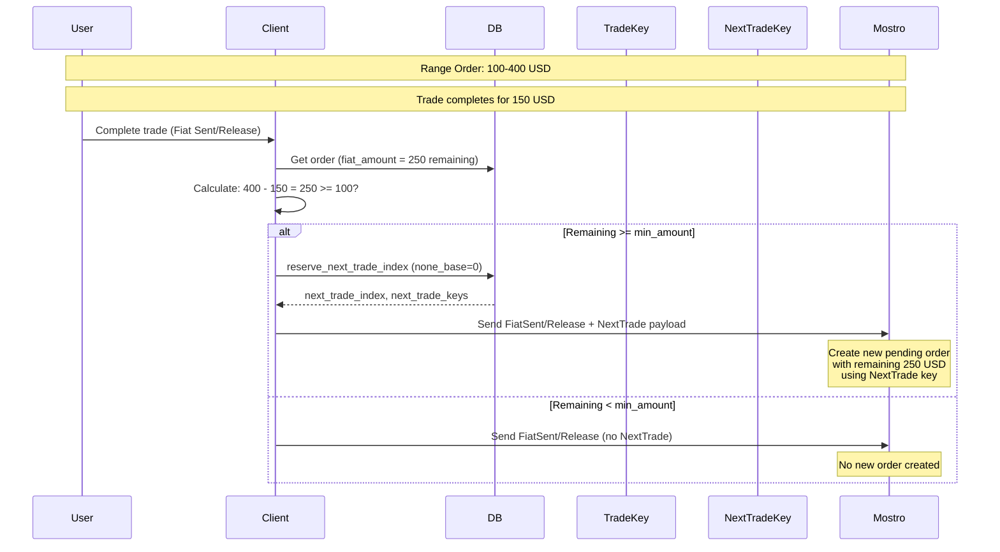

# Range Orders

Range orders allow users to create orders with variable amounts within a specified range (e.g., "Sell 100-400 USD"). This enables more flexible trading where buyers can take partial amounts from a larger order.

## How Range Orders Work

1. **Order Creation**: A range order is created with:
   - `min_amount`: Minimum trade amount (e.g., 100 USD)
   - `max_amount`: Maximum trade amount (e.g., 400 USD)
   - `fiat_amount`: Current amount available (starts at `max_amount`)

2. **Taking Range Orders**: Users can take any amount between `min_amount` and the remaining `fiat_amount`.

3. **Trade Completion**: When a trade completes (via `FiatSent` or `Release` actions), Mostrix checks if there's remaining amount to create a new pending order.

## NextTrade Payload

Before completing a range order trade, Mostrix must inform the Mostro daemon about the next trade key that will be used for the remaining amount. This is done via the `NextTrade` payload.

**Source**: `src/util/order_utils/execute_send_msg.rs:23`
```23:28:src/util/order_utils/execute_send_msg.rs
                    let (next_trade_index, next_trade_keys) =
                        User::reserve_next_trade_index(pool, 0).await?;

                    Ok(Some(Payload::NextTrade(
                        next_trade_keys.public_key().to_string(),
                        next_trade_index as u32,
```

## Range Order Logic

When completing a trade (`FiatSent` or `Release`):

1. **Check if range order**: Verify the order has both `min_amount` and `max_amount` set.

2. **Calculate remaining amount**: `remaining = max_amount - fiat_amount`

3. **Check if new order needed**:
   - If `remaining >= min_amount`: Create `NextTrade` payload with:
     - Reserve next trade key via `User::reserve_next_trade_index(pool, 0)`
     - Send the new trade key's public key and index to Mostro
     - Mostro will create a new pending order with the remaining amount
   - If `remaining < min_amount`: No new order is created (send `None` payload)

4. **Mostro creates new order**: Upon receiving the `NextTrade` payload, Mostro daemon creates a new pending order with:
   - The remaining amount (`max_amount - fiat_amount`)
   - The new trade key public key
   - The new trade index

## Example Flow



## Key Points

- **Range orders** enable partial fills of larger orders
- **NextTrade payload** must be sent **before** completing the trade so Mostro knows which key to use for the new order
- If remaining amount is **less than minimum**, no new order is created
- Each new order created from a range order uses a **fresh trade key** for privacy
